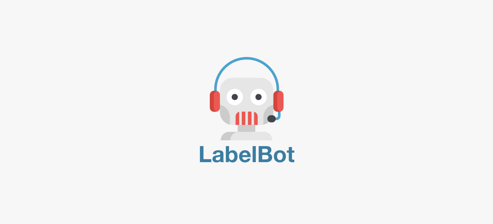
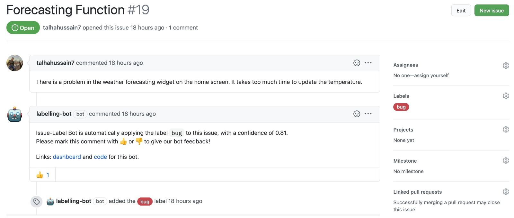

# Github Issue-Label Prediction Application
LabelBot is a Github application that can be used to automatically tag an issue with a Github label. It uses machine learning to read the comment body and title to estimate what the issue might be about, and then labels the issue following publishing a short comment notifying the issue creator of the same.  As of now, the LabelBot is capable of classifying an issue as a ‘question’, ‘bug’ or ‘enhancement’. 
#In Action

The maintainer of the repository can install this Github application on a repository of their choice to make the automatic labelling feature available for anyone who makes an issue on the repository.

# Links 
Read more about it here: <https://labelling-bot.netlify.app/>
 
Get it on Github:  <https://github.com/apps/labelling-bot>
# The Team
Haider Ali: [ali.haider7111@gmail.com](mailto:ali.haider7111@gmail.com) 
Gagandeep Singh: [gaganrattan9@gmail.com](mailto:gaganrattan9@gmail.com) 
Mujahid Khan:    [mnk1998@gmail.com](mailto:mnk1998@gmail.com) 
Talha Hussain:   [talhahussainb@gmail.com](mailto:talhahussainb@gmail.com) 
